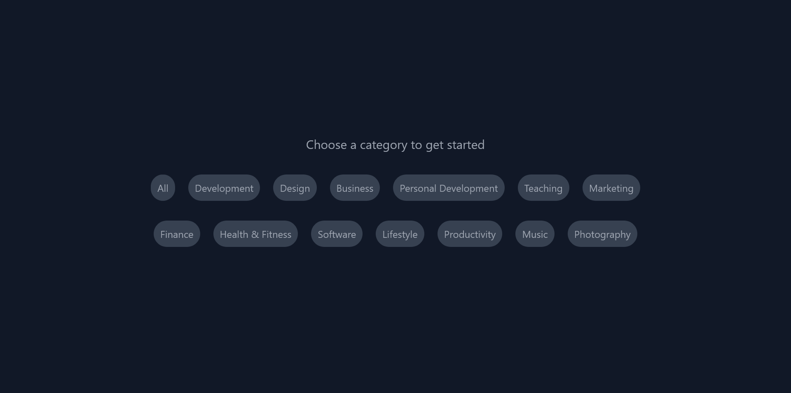
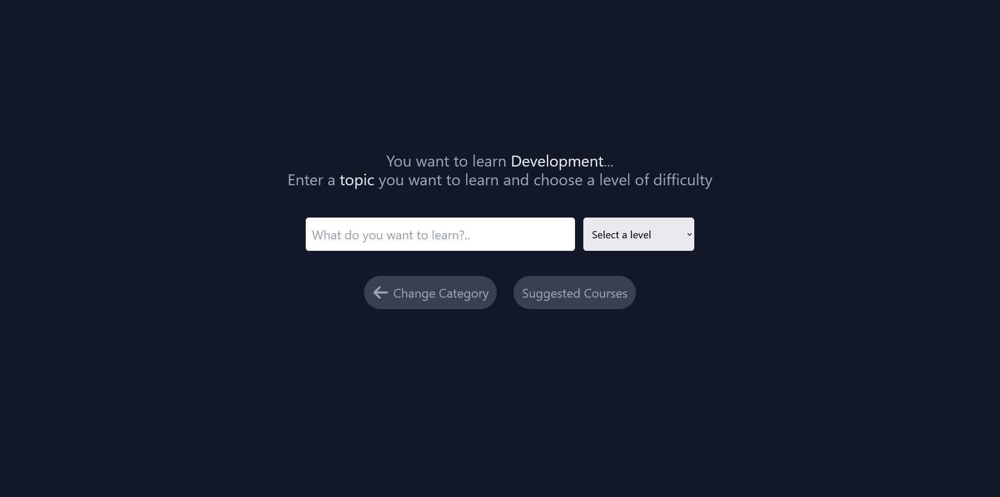
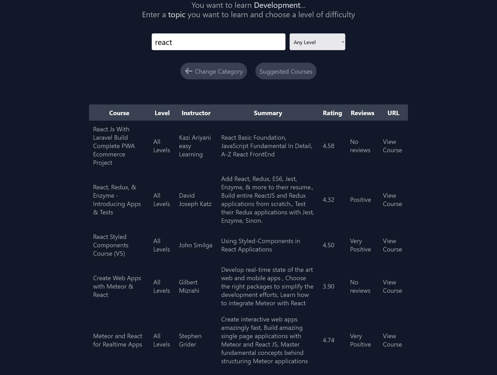
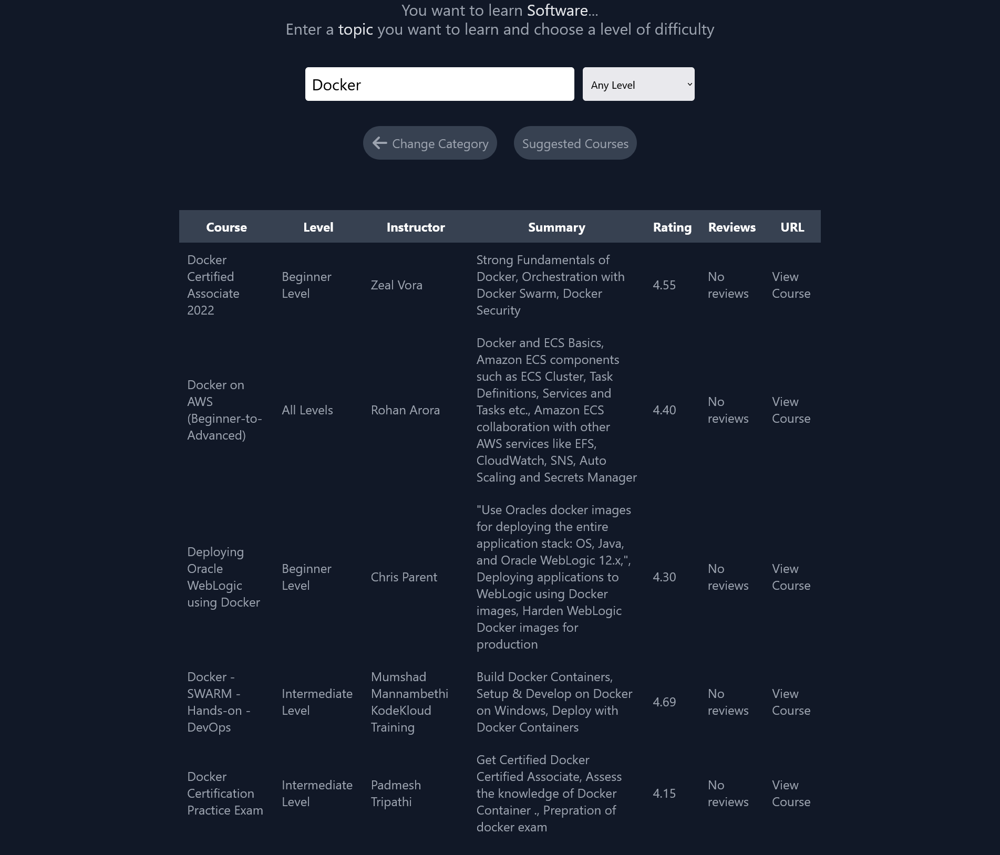

# Udemy Course Suggestor

An Intership Project

# Contributors

[Aleyna Mandacı](https://github.com/aleynamandaci)
[Barış Kılıç](https://github.com/baris-kilic)
[Banu Uçar](#)
[Mehmet Koç](https://github.com/memodesen)
[Ümit Kara](https://github.com/umitkara)
## Description

In this project we built a recomendataion engine for Udemy courses. We build this model with using 2 different datasets (1 - [Course](https://www.kaggle.com/datasets/andrewmvd/udemy-courses) and 2 - [Reviews](https://www.kaggle.com/datasets/sabrisangjaya/udemy-course-review)). With course dataset we build a clustering model using K-Means algorithm with K = 1500. With the clustering model we can get the cluster of each course. With the cluster we can get the course that is most similar to the course that we want to recommend.

After clustering we made sentimental analysis over the reviews of each course. With the sentimental analysis we generate an aggregate compound score for each course. With this score we show user how the reviews of the course are.

Using the model we build a recommendation system with web interface. With the interface, user can select a learning category, enter a topic to learn and choose a course level. With these data we suggest maximum 5 unique courses to the user to check out.

## Screenshots

Welcome Screen

Course category selection

Topic and level selection

A recommendation on 'ract' topic for any levels

A recommendation on 'docker' topic for any levels

